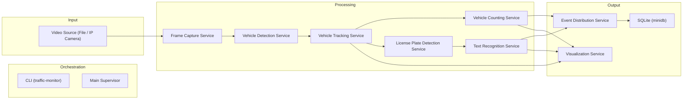
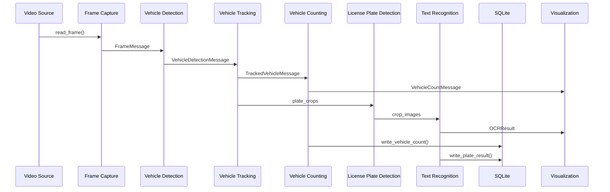
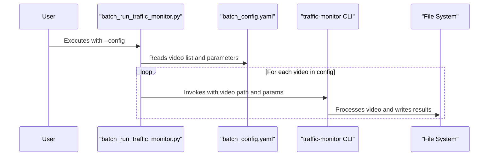

## Architecture Design and Deployment Considerations

### High-Level System Architecture



### End-to-End Workflow



<!-- The detailed component descriptions follow below -->

### Configuration Loading and Management

**Centralized Configuration Loading:**
The responsibility for loading the default configuration (`settings.yaml`) is centralized in [`main_supervisor.py`](../src/traffic_monitor/main_supervisor.py). At startup, the supervisor loads the base configuration from an absolute, robust path within the package directory. Any configuration overrides provided via the CLI or interactive prompts are merged into the base configuration using a deep dictionary merge strategy, ensuring nested values are correctly overridden.

**Path Resolution:**
The supervisor uses `pathlib.Path` and `__file__` to reliably locate the configuration file, regardless of whether the application is run from source or as an installed package.

**Safe Access:**
All configuration access uses `.get()` with default values to prevent `KeyError` if a section or key is missing.

**CLI Role:**
[`cli.py`](../src/traffic_monitor/cli.py) is responsible only for collecting user input and passing it as a dictionary to the supervisor; it does not load the default configuration itself.

**Error Handling:**
If the default configuration cannot be loaded, the supervisor logs a critical error and exits gracefully.

**Summary of Flow:**

1. Supervisor loads default `settings.yaml`.
2. Supervisor merges CLI/interactive overrides (deep merge).
3. All components receive a complete, validated configuration dictionary.
4. Safe access patterns prevent runtime errors due to missing keys.

### FrameCaptureService Component

**Purpose:** The `FrameCaptureService` component is responsible for ingesting video streams and providing raw frames to downstream components. It also supports optional frame skipping to reduce processing load.

**Area of Responsibility:**

- Capturing video frames from various sources (local files, IP cameras).
- Resizing frames to a configurable resolution.
- Encoding frames to JPEG for efficient inter-process transfer.
- Assigning unique IDs and timestamps to each frame.
- Implementing configurable frame skipping based on `process_every_n_frame`.

**Compute Requirements:**

- Primarily CPU-bound due to video decoding and image resizing/encoding.
- Performance is directly related to video resolution and frame rate.

**Storage Requirements:**

- No persistent storage required; frames are processed in-memory and passed via queues.

**Interfaces:**

- **Input:** Configured `video_source` path or camera index.
- **Output:** Sends `FrameMessage` objects to the `VehicleDetectionService` process via a multiprocessing queue. Each message contains JPEG-encoded frame data, metadata, and unique identifiers.

**Dependencies:**

- **Internal:** `multiprocessing`, `cv2`, `loguru`, `src.traffic_monitor.utils.logging_config`.
- **External:** `opencv-python` for video capture and image manipulation.

**Configuration:**

- `video_source` (str): Path to video file or camera index.
- `resize_resolution` (list): Target resolution for frames (e.g., `[1280, 720]`).
- `log_every_n_frames` (int): Frequency for logging frame processing status.
- `process_every_n_frame` (int): Specifies how many frames to skip (e.g., `1` for no skipping, `2` to process every other frame). Default is 1.

### VehicleTrackingService Component

**Purpose:** The `VehicleTrackingService` component is responsible for managing vehicle tracking logic using the BoxMOT library. It initializes the tracker and processes raw detections from the `VehicleDetectionService` into tracked objects.

**Area of Responsibility:**

- Initializing the BoxMOT tracker with specified configuration.
- Converting raw detection data into a format suitable for the tracker.
- Updating the tracker with new detections and retrieving tracked objects.
- Converting tracked objects from the tracker's internal format to a standardized output format (`TrackedObject` dictionaries).

**Compute Requirements:**

- Primarily CPU-bound, but can leverage GPU if `device` is set to `cuda` and a compatible ReID model is provided.
- Memory usage depends on the number of tracked objects and frame resolution.

**Storage Requirements:**

- Requires access to `reid_model_path` (e.g., `data/models/reid.pt`) for ReID models.
- Requires access to `tracker_config` (e.g., `src/traffic_monitor/config/bytetrack.yaml`) for tracker-specific configurations.

**Interfaces:**

- **Input:** Receives `VehicleDetectionMessage` objects from the `VehicleDetectionService` process via a multiprocessing queue. Each message contains frame data and a list of `Detection` objects.
- **Output:** Sends `TrackedVehicleMessage` objects to downstream processes (e.g., for visualization or data logging) via a multiprocessing queue. Each message includes tracked objects, frame metadata, and JPEG-encoded frame data.

**Dependencies:**

- **Internal:** `multiprocessing`, `cv2`, `numpy`, `loguru`, `pathlib`, `src.traffic_monitor.utils.custom_types`.
- **External:** `boxmot` library for tracking functionalities.

### Inter-process Communication

The system utilizes `multiprocessing.Queue` for inter-process communication between the `FrameCaptureService`, `VehicleDetectionService`, and `VehicleTrackingService` components. The following queues are configured with a `maxsize` of 100 to accommodate processing loads and prevent frame drops:

- **`frame_capture_output_queue`**: Transfers `FrameMessage` objects from `FrameCaptureService` to `VehicleDetectionService`.
- **`vehicle_detection_output_queue`**: Transfers `VehicleDetectionMessage` objects from `VehicleDetectionService` to `VehicleTrackingService`.
- **`vehicle_tracking_output_queue`**: Transfers `TrackedVehicleMessage` objects from `VehicleTrackingService` to downstream processes (e.g., for visualization or data logging).

**Configuration:**

- `tracker_type` (str): Type of tracker to use (e.g., "bytetrack").
- `reid_model_path` (Path): Path to the ReID model weights.
- `device` (str): Device to run the tracker on (e.g., "cpu", "cuda").
- `half` (bool): Whether to use half-precision (FP16) for inference (typically for GPU).
- `per_class` (bool | None): Whether to track objects per class.
- `tracker_config` (Path): Path to the tracker-specific configuration file (e.g., `src/traffic_monitor/config/bytetrack.yaml`).

### Logging Configuration

**Purpose:** The logging system is configured to provide clear and actionable insights into the application's runtime behavior, facilitating debugging and monitoring.

**Area of Responsibility:**

- Centralized logging setup via `src/traffic_monitor/utils/logging_config.py`.
- Customizable logging levels and formats.
- Output to both console and file for comprehensive record-keeping.
- **Multiprocessing Support:** Each child process (VehicleDetectionService, VehicleTrackingService, LicensePlateDetectionService, TextRecognitionService) independently sets up logging to ensure proper log output from all processes.

**Configuration:**

- The default terminal output level is set to `INFO` to minimize verbose debug messages in the console.
- Logging parameters such as level, format, file path, rotation, retention, and compression can be configured via `loguru` section in `src/traffic_monitor/config/settings.yaml`.
- **Process-Specific Logging:** Each process function calls `setup_logging()` at startup to ensure consistent logging configuration across all processes.

**Dependencies:**

- Each multiprocessing service (`license_plate_detection_process`, `text_recognition_process`, etc.) must import and call `setup_logging()` to initialize logging properly.

### Vehicle Counter Service

- **Technical Requirements**: Handles vehicle counting based on predefined counting lines. Processes `TrackedVehicleMessage` and outputs `VehicleCountMessage`.
- **Area of Responsibility**: Detecting when a tracked vehicle crosses a designated line and maintaining counts by class and total.
- **Compute**: Primarily CPU-bound, performing geometric calculations and dictionary operations.
- **Storage**: Stores current vehicle positions and counted track IDs in memory.
- **Interface toward other components**:
  - **Input**: Receives `TrackedVehicleMessage` from `Vehicle Tracker` via an input queue.
  - **Output**: Sends `VehicleCountMessage` to `Main Supervisor` via an output queue.
- **Dependency to other components**: Depends on `shapely` for geometric operations and `loguru` for logging. Receives data from `Vehicle Tracker`.

### OCR Component

**Purpose:** The `TextRecognitionService` component is responsible for performing Optical Character Recognition (OCR) on image regions, specifically for license plates. It supports multiple OCR engines selectable at runtime via the `backend` parameter ("fast_plate_ocr" or "paddleocr").

**Area of Responsibility:**

- Initializing selected OCR engine (e.g., FastPlateOCR, PaddleOCR) with specified configurations.
- Processing image crops containing license plates to extract text and confidence scores.
- Handling pre-processing and post-processing steps specific to each OCR engine.

**Compute Requirements:**

- Can be CPU or GPU bound depending on the OCR engine and its configuration.
- Memory usage depends on image resolution and the complexity of the OCR model.

**Storage Requirements:**

- Requires access to OCR model weights (e.g., `data/models/plate_v8n.onnx`, `data/models/lp.pt`).
- Requires access to OCR engine-specific configurations.

**Interfaces:**

- **Input:** Receives image crops (e.g., license plate regions) from `LicensePlateDetectionService` or other components via a multiprocessing queue.
- **Output:** Sends `OCRResult` objects containing recognized text, confidence, and processing time to downstream processes (e.g., for visualization or data logging) via a multiprocessing queue.

**Dependencies:**

- **Internal:** `multiprocessing`, `cv2`, `numpy`, `loguru`, `pathlib`, `src.traffic_monitor.utils.custom_types`.
- **External:** `fast_plate_ocr` or `paddleocr` libraries, depending on the chosen engine.

### Persistence Component (SQLite)

**Purpose:** The `minidb` utility provides lightweight SQLite persistence for storing plate recognition results and vehicle count data without requiring external database servers.

**Area of Responsibility:**

- Creating and managing SQLite database schema with proper indexing.
- Storing plate detection results with timestamp, camera ID, vehicle ID, license plate text, and confidence.
- Storing vehicle count events with timestamp, camera ID, total count, and class-specific counts.
- Handling database locks with automatic retry and exponential backoff.
- Enabling WAL mode for better concurrency between processes.

**Compute Requirements:**

- Minimal CPU overhead for database operations.
- I/O bound for database writes, optimized with WAL mode.

**Storage Requirements:**

- Single SQLite file (`traffic_monitor.db`) in project root.
- Automatic directory creation if needed.
- Indexed storage for efficient queries by camera and timestamp.

**Interfaces:**

- **Input:** Called directly by services via `write_plate_result()` and `write_vehicle_count()` functions.
- **Output:** SQLite database file available for analytics, reporting, and external tools.

**Dependencies:**

- **Internal:** Built-in `sqlite3` module, `loguru` for logging, `pathlib` for file operations.
- **External:** None - uses Python standard library only.

## System Components

This section outlines higher-level tools and utilities that orchestrate or evaluate the core processing pipeline.

### E2E Benchmarking Pipeline

**Purpose:** The E2E (End-to-End) benchmarking system provides comprehensive evaluation of the complete traffic monitoring pipeline, measuring both accuracy and performance metrics for research validation and CI/CD integration.

**Area of Responsibility:**

- Running the complete pipeline on evaluation video sets with ground truth annotations.
- Collecting predictions from all components (vehicle detection, tracking, plate recognition, counting).
- Computing system-level metrics that combine component performances (vehicle identification F1, plate recognition accuracy, counting MAE).
- Profiling resource usage (CPU, GPU, memory) and timing (latency, throughput).
- Automatically gating CI/CD pipelines based on performance thresholds.

**Compute Requirements:**

- Requires the same compute resources as the main pipeline (CPU/GPU for inference).
- Additional overhead for profiling and metrics computation (~5-10%).
- Configurable for speed vs accuracy tradeoffs (fast vs production configs).

**Storage Requirements:**

- Evaluation videos stored in `data/eval/videos/`.
- Ground truth events in JSON format in `data/eval/ground_truth/`.
- Benchmark results output to `output/benchmarks/` with timestamped directories.
- Detailed profiling data saved as CSV for analysis.

**Interfaces:**

- **Input:**
  - Video configuration YAML (`configs/benchmark/eval_videos.yaml`)
  - Pipeline configuration YAML (`configs/benchmark/prod.yaml` or `fast.yaml`)
  - Ground truth event files (`*.events.json`)
- **Output:**
  - Comprehensive metrics JSON (`metrics.json`)
  - Detailed profiling CSV (`profiling.csv`)
  - Predicted events JSON (`*.pred.json`)
  - CI/CD status reports and GitHub Actions summaries

**Dependencies:**

- **Internal:** All pipeline components, `traffic_monitor.eval.e2e_evaluator`, `traffic_monitor.utils.profiler`
- **External:** `psutil` for system monitoring, `pynvml` for GPU monitoring, `pandas` for profiling output

**Key Components:**

1. **Profiler (`src/traffic_monitor/utils/profiler.py`)**: Lightweight timing and resource monitoring
2. **E2E Evaluator (`src/traffic_monitor/eval/e2e_evaluator.py`)**: Metrics computation and ground truth matching
3. **Benchmark Runner (`tools/benchmark_e2e.py`)**: Main orchestration script
4. **Threshold Checker (`tools/assert_thresholds.py`)**: CI/CD gating based on performance requirements
5. **GitHub Actions Workflow (`.github/workflows/benchmark.yml`)**: Automated CI integration

**Evaluation Metrics:**

- **Vehicle Identification**: Precision, Recall, F1 (temporal matching of detected tracks)
- **Plate Recognition**: Exact-match accuracy for recognized license plates
- **Vehicle Counting**: MAE, RMSE, sMAPE against ground truth counts
- **Queue Length**: MAE for traffic queue estimation
- **Performance**: Mean/P95 latency, FPS, CPU/GPU utilization
- **Overall**: Combined F1 score for system-level assessment

**Configuration Profiles:**

- **Production (`configs/benchmark/prod.yaml`)**: Maximum accuracy, full resolution, all frames
- **Fast (`configs/benchmark/fast.yaml`)**: Speed optimized, lower resolution, frame skipping

### Batch Processing Utility

**Purpose:** The Batch Processing Utility provides a streamlined way to run the core traffic monitoring pipeline on multiple video files sequentially. It is designed for offline analysis, where a user can define a set of videos and their corresponding configurations in a single YAML file and execute them in one command.

**Relationship with Core Pipeline:**

The batch utility acts as an orchestrator for the main `traffic-monitor` CLI. It parses a batch configuration file and invokes a new CLI process for each video, passing the appropriate parameters. This design decouples the batch logic from the core processing pipeline, ensuring that the main application remains focused on single-source processing.



**Output Directory Structure:**

To maintain organized and traceable results, the batch runner follows a standardized output directory pattern. For each batch execution, a parent directory is created based on the name of the batch configuration file. Inside, subdirectories are created for each processed video.

```
output/batch_runs/
└── {batch_config_name}/
    ├── {video_1_name}/
    │   ├── results.json
    │   └── annotated_video.mp4
    ├── {video_2_name}/
    │   ├── results.json
    │   └── annotated_video.mp4
    └── ...
```

**Further Documentation:**

For detailed information on configuration, usage, and related scripts, please refer to the component-specific documentation: [`COMPONENT_BATCH_DOCS.md`](docs/COMPONENT_BATCH_DOCS.md).
