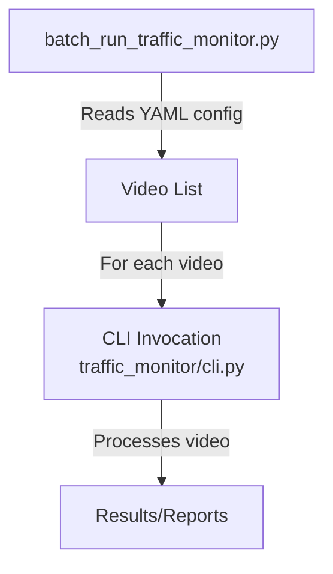

# Batch Processing Component Documentation

## Purpose

Batch video processing utility for offline analysis. This component enables automated, sequential processing of multiple video files using the Traffic Monitor CLI, based on a user-defined YAML configuration.

---

## Configuration Format

The batch runner expects a YAML configuration file specifying global options and a list of videos to process. Each video can inherit global settings or override them as needed.

**Example (`batch_config.yaml`):**

```yaml
# Path to the regular Traffic Monitor YAML settings. Optional.
traffic_monitor_config: config/settings.yaml

# Counting line(s) applied to every video unless overridden. Optional.
default_count_lines:
  - "100,200,400,200"

# Global CLI log level (DEBUG, INFO, WARNING, ERROR) – optional.
log_level: INFO

# List of videos to process.
videos:
  # Inherits default_count_lines
  - data/videos/cam_01.mp4

  # Override counting lines for this file
  - file: data/videos/cam_02.mp4
    count_lines:
      - "50,100,600,100"
      - "50,500,600,500"

  # Disable counting lines for this file
  - file: data/videos/no_lines.mkv
    count_lines: []
```

---

## Integration Diagram



---

## Related Classes and Scripts

- [`batch_run_traffic_monitor.py`](tools/batch_run_traffic_monitor.py): Batch runner script (YAML parsing, CLI orchestration)
- [`cli.py`](refsrc/traffic_monitor/cli.py): Main Traffic Monitor CLI entry-point

---

## Usage Instructions

From the script docstring:

```text
Usage:

    python tools/batch_run_traffic_monitor.py -c batch_config.yaml

The script will print each command before running it so you can see exactly what is being executed.
```
