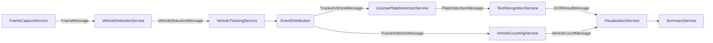
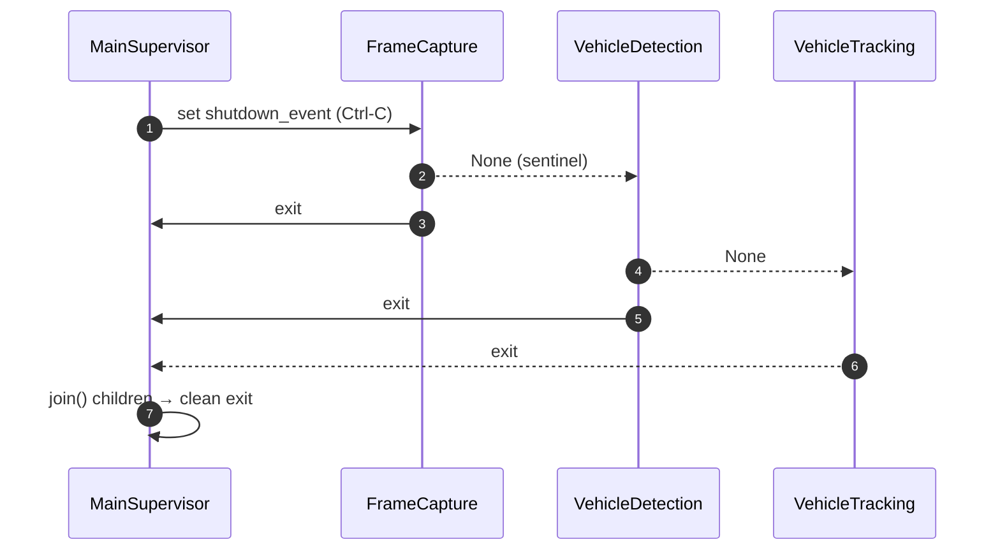

# Traffic Monitor – Detailed Project Report

> **Version:** 1.0  |  _Last generated: <!--date-->_

---

## 1  Introduction
The **Traffic Monitor** project is a multiprocessing-based computer-vision pipeline that ingests raw video, detects and tracks vehicles, recognises licence plates, counts traffic flow, renders visual overlays, and persists structured results.  The system is engineered for both **real-time** (low-latency) and **offline/batch** (full-fidelity) modes, emphasising modularity, configurability, and observability—making it an ideal subject for an academic thesis on modern video-analytics architecture.

This report documents:
1. High-level architecture and data-flow.
2. End-to-end runtime workflow.
3. Directory and file-level responsibilities, including inputs & outputs.
4. Design decisions, best-practice references, and future-work pointers.

---

## 2  High-Level Architecture
The application decomposes the video-analytics problem into **independent services (processes)** that communicate via [`multiprocessing.Queue`](https://docs.python.org/3/library/multiprocessing.html#pipes-and-queues).  Each service is stateless (other than model weights) and can therefore be scaled horizontally or swapped for alternative implementations.

### 2.1  Process Orchestration
* `traffic_monitor.main_supervisor` is the **orchestrator**.  It
  1. loads YAML configuration, 2. initialises database/logging, 3. creates queues, 4. spawns each service process with a **graceful shutdown** event, and 5. blocks until all child processes exit.
* `traffic_monitor.cli` provides a **Click**-based UX for launching the supervisor with ad-hoc overrides (e.g. live vs offline mode, video source, counting-lines, etc.).

### 2.2  Queue Management Strategy
`utils.queue_utils` exposes `safe_put`, `put_realtime` and `put_offline`, selecting the low-latency *leaky-queue* strategy for live mode and *loss-less* strategy for offline analysis, following best practices from GStreamer & OBS Studio.

### 2.3  What Happens When You Press “Run”?
Below is a concise, beginner-friendly walkthrough of the first few seconds of a typical session:
1. **CLI** parses your command-line flags and loads `settings.yaml`.
2. **MainSupervisor** spawns a *separate* Python process for each service.  Each process gets its own memory space, so a GPU-heavy model in the detector cannot crash the whole app.
3. **Queues** are created *before* forking so that every child already has a handle to the same queue objects.
4. **FrameCaptureService** starts reading the video and immediately pushes the first `FrameMessage` into its output queue.
5. **VehicleDetectionService** blocks on `input_queue.get()` until a frame arrives, then performs YOLO inference and continues the chain.

> 🤔 **Why multiple processes instead of threads?**  Deep-learning libraries (PyTorch, Ultralytics) release the GIL **only sometimes**.  Multiprocessing bypasses the GIL entirely, allowing true parallelism on multi-core CPUs and separate GPU streams.

### 2.4  Process Synchronisation & Graceful Shutdown
The supervisor uses **two complementary mechanisms** to keep all services in sync:

1. **Shutdown Event (`multiprocessing.Event`)**  
   A boolean flag set by the supervisor (or by any child on fatal error).  Every service checks `shutdown_event.is_set()` inside its main loop and exits when it changes to `True`.
2. **Sentinel Messages (`None`)**  
   When a producer reaches end-of-stream it *also* puts a `None` into its output queue.  Consumers treat `None` as “upstream finished” and propagate the sentinel downstream before exiting.  This cascading effect ensures the *whole* pipeline stops in the correct order.

**Key take-away:** *Either* the event *or* the sentinel is enough to stop a loop; using both prevents rare dead-lock scenarios where a queue is empty but the event isn’t set (or vice-versa).

---

## 3  Runtime Workflow
1. **FrameCaptureService** opens a camera/RTSP/video file, resizes frames, encodes them as JPEG (`frame_data_jpeg`) and emits `FrameMessage`s.
2. **VehicleDetectionService** performs YOLOv8 inference, filters detections by class, and returns `VehicleDetectionMessage`s.
3. **VehicleTrackingService** feeds detections to **BoxMOT** (e.g. ByteTrack, OC-SORT) and emits `TrackedVehicleMessage`s that maintain persistent `track_id`s across frames.
4. The **event_distribution_service** fan-outs tracking messages to:
   * **VehicleCountingService** – intersects tracks with virtual counting lines and accumulates statistics.
   * **LicencePlateDetectionService** – crops each vehicle bbox, runs a dedicated YOLOv8 model to localise the plate.
5. **TextRecognitionService** extracts plate crops and applies OCR using either
   * `fast_plate_ocr` (CCT-S) _or_
   * **PaddleOCR v5**, returning `OCRResultMessage`s.
6. **VisualizationService** composites all upstream data onto the frames (bounding boxes, track IDs, FPS, counts, plate text) and optionally saves a timestamped MP4 to `data/videos/output/<run-id>/`.
7. **SummaryService** aggregates metrics across the run (FPS, detection/tracking counts, OCR success-rate, etc.), persists them to SQLite and exports a machine-readable JSON plus a human-readable Markdown summary.

> **Fail-fast philosophy:** Every process catches exceptions, logs them via **Loguru**, sends a sentinel `None` downstream, and exits—allowing the supervisor to shut down cleanly.

---

## 4  Directory Structure
The project is organised as follows:

* **src/traffic_monitor/** – Core Python package containing all runtime code.
* **src/traffic_monitor/services/** – One module per multiprocessing service.
* **src/traffic_monitor/utils/** – Shared helpers for logging, database access, queue management, profiling, etc.
* **src/traffic_monitor/config/** – YAML settings and BoxMOT tracker presets.
* **docs/** – All design notes, component guides, and generated reports (including this document).
* **data/** – Pre-trained models, sample videos, generated artefacts, and the SQLite database.
* **scripts/** – One-off maintenance or data-processing scripts.
* **tests/** – PyTest regression and unit tests.

---

## 5  Component Responsibilities

Below is a textual walkthrough of the most important modules and what they contribute to the overall pipeline.

### 5.1  Top-Level Orchestration

* `src/traffic_monitor/cli.py` – Command-line entry-point.  Parses arguments with **Click**, merges them with the YAML configuration, creates a timestamped output directory, and launches the supervisor.
* `src/traffic_monitor/main_supervisor.py` – The orchestrator that constructs the inter-process queues, initialises logging and the database, spawns every child process using the safe `'spawn'` start method, and coordinates graceful shutdown.

### 5.2  Messaging Contract

* `src/traffic_monitor/utils/custom_types.py` – Houses a set of `TypedDict` schemas (`FrameMessage`, `VehicleDetectionMessage`, etc.).  These act as a _formal contract_ between services, enabling static analysis while keeping the system loosely coupled.

### 5.3  Core Services

* **frame_capture_service.py** – Opens the camera, RTSP stream, or video file, resizes frames, encodes each as JPEG, and emits a `FrameMessage`.
* **vehicle_detection_service.py** – Runs YOLOv8 inference, filters detections by `class_mapping`, and outputs a `VehicleDetectionMessage`.
* **vehicle_tracking_service.py** – Maintains object identity with BoxMOT (ByteTrack, OC-SORT, etc.) and produces a `TrackedVehicleMessage`.
* **event_distribution_service.py** – Lightweight fan-out that copies each incoming message to multiple downstream queues while propagating shutdown sentinels.
* **vehicle_counting_service.py** – Intersects tracks with virtual counting lines, updates cumulative counts, and yields a `VehicleCountMessage`.
* **license_plate_detection_service.py** – Runs a compact YOLOv8 model on each vehicle crop to localise the licence plate and returns a `PlateDetectionMessage`.
* **text_recognition_service.py** – Performs OCR (FastPlateOCR or PaddleOCR) on plate crops and writes recognised text to SQLite as well as emitting an `OCRResultMessage`.
* **visualization_service.py** – Renders bounding boxes, track IDs, plate text, FPS, and counters onto the video; optionally produces an MP4 in `data/videos/output/<run-id>/`.
* **summary_service.py** – Aggregates runtime metrics (FPS, detection counts, OCR success-rate) and produces machine-readable JSON plus a Markdown recap.

#### Detailed Design of Core Services

##### FrameCaptureService (`services/frame_capture_service.py`)
* **Primary role:** Acts as the video-ingest front-end.  It opens a camera index, RTSP URL, or file and streams frames into the pipeline.
* **Key configuration keys**
  * `video_source` – integer (camera index) or string (RTSP/file path).
  * `resize_resolution` – `[w, h]` to standardise frame size for downstream models.
  * `process_every_n_frame` – frame-skipping rate for speed/CPU trade-offs.
  * `offline_mode` – toggles queue strategy (loss-less vs leaky).
  * `start_time_sec`, `max_frames` – evaluation-mode knobs.
* **Processing pipeline**
  1. Read frame via OpenCV (`cv2.VideoCapture`).
  2. Resize and JPEG-encode (`cv2.imencode`).
  3. Package into a `FrameMessage` with dimensions, FPS, and a UUID `frame_id`.
  4. Push to the next queue using `safe_put`.
* **Performance notes:** JPEG encoding is CPU-bound; consider hardware encoders (NVJPEG) for >30 FPS 1080p streams.
* **Failure handling:** On end-of-stream or exception the service sends a `None` sentinel, logs via Loguru, releases the capture handle, and exits gracefully.

##### VehicleDetectionService (`services/vehicle_detection_service.py`)
* **Model:** YOLOv8 object detector loaded via `ultralytics.YOLO`.
* **Filtering:** Only class IDs present in `class_mapping` are forwarded → lower false positives and reduces tracker load.
* **Snapshot debugging:** Optional snapshot mechanism writes annotated frames to `docs/snaps/02_detect/` at a configurable interval.
* **Concurrency:** Runs in its own process; GPU/CPU selection is handled by Ultralytics internally via the `device` flag.

##### VehicleTrackingService (`services/vehicle_tracking_service.py`)
* **Algorithm:** BoxMOT wrapper (supports ByteTrack, DeepOC-SORT, etc.).  Maintains consistent `track_id` across frames by associating detections using motion & appearance cues (`reid_model_path`).
* **N-Dimensional optimisation:** Internally converts detection lists → NumPy arrays for vectorised processing.
* **Edge-cases:** Emits an empty `TrackedVehicleMessage` when detections are absent; prevents downstream crashes.

##### EventDistributionService (`services/event_distribution_service.py`)
* **Why it exists:** Decouples the fan-out concern from business logic.  A single tracked-object stream can be consumed by multiple services without extra producer load.
* **Back-pressure:** Uses `safe_put` for each branch; if one branch is full (real-time mode) it will drop the oldest message in that branch only—isolating congestion.

##### VehicleCountingService (`services/vehicle_counting_service.py`)
* **Spatial logic:** Converts user-supplied counting lines (absolute or relative) into `shapely.LineString`s and checks intersection with each track’s movement vector.
* **State:** Maintains a set of `counted_track_ids` to ensure “at-most-once” counting.
* **Persistence:** Each successful count is upserted into SQLite via `utils.minidb.write_vehicle_count()`.

##### LicensePlateDetectionService (`services/license_plate_detection_service.py`)
* **Pipeline:** For every tracked vehicle, crops the ROI, passes it through a lightweight YOLOv8 plate detector, back-projects the plate bbox to the original frame coordinates, and emits a `PlateDetectionMessage`.
* **Optimisations:** Skips vehicles whose crops fall outside frame bounds; avoids unnecessary GPU calls.

##### TextRecognitionService (`services/text_recognition_service.py`)
* **Backends:**
  * `fast_plate_ocr` – Transformer-based, fine-tuned for licence plates.
  * `PaddleOCR v5` – Generic OCR with support for multilingual text.
* **Adaptive pre-processing:** Converts plate crops to grayscale only when using FastPlateOCR (its model expects single-channel inputs).
* **Database writes:** Successful OCR results are recorded in two tables (`plate_results` + `plate_results_latest`) to facilitate both historical queries and quick “last seen” look-ups.

##### VisualizationService (`services/visualization_service.py`)
* **Drawing engine:** Leverages OpenCV’s high-performance primitives (rectangle, line, putText).  Colours can be configured per class in YAML.
* **Frame-rate regulation:** Maintains a deque of timestamps (`fps_calculator`) to compute a rolling FPS over the last 60 frames.
* **Output options:**
  * Live preview (`cv2.imshow`) – disabled by default in headless environments.
  * Offline render – writes MP4 with a configurable FOURCC; honours the **original** video FPS for smooth playback.

##### SummaryService (`services/summary_service.py`)
* **Metric families:** throughput (FPS), accuracy (detection/track/OCR counts), quality (frame drops, processing errors), and configuration provenance.
* **JSON + Markdown export:** Saves both machine-readable and thesis-ready recaps to `data/reports/<run-id>/`.
* **Extensibility hooks:** Add new metrics by calling `record_*` helpers inside any service — minimal coupling.

### 5.4  Shared Utilities – In-Depth

* **queue_utils.py** – Implements a dual-mode queue strategy:
  * **Real-time:** `put_realtime()` drops the oldest item then `put_nowait()`s the new one → bounded latency.
  * **Offline:** `put_offline()` blocks until the queue has space, ensuring no data loss.
  * Helper `log_queue_stats()` periodically logs `qsize()` for observability.
* **logging_config.py** – Abstracts Loguru setup with:
  * Colourised console formatter _or_ structured JSON (triggered via `LOG_FORMAT=json`).
  * File rotation (`10 MB`) and retention (`7 days`) using compression.
  * `SensitiveDataFilter` that redacts credit-card numbers, licence plates, and API keys from logs – aligned with GDPR best practices.
* **minidb.py** – Sets SQLite pragmas (`WAL`, `synchronous=NORMAL`, `cache_size=10000`) for write concurrency; exposes typed upsert helpers.  All connections are thread-local to avoid `sqlite3.ProgrammingError` in multithreaded contexts.
* **config_loader.py** – Thin wrapper over PyYAML with rich error messages and unit-test coverage; returns `None` instead of raising to allow the supervisor to fail gracefully.
* **profiler.py** – Simple decorator/context-manager that logs elapsed wall-time; helpful for micro-benchmarking individual pipeline stages.
* **utils.py** – Geometry helpers such as `relative_to_absolute_coords()` guarantee that UI overlays and counting logic remain correct after frame resizing.

### 5.5  Peripheral Code

* `database_utils.py` – Experimental helper for bulk queries and migrations, used mostly during exploratory data analysis.
* `main.py` – Minimal “hello world” stub.
* `tests/` – PyTest suites that guard against regressions (e.g., OCR integration tests).
* `scripts/` – Ad-hoc scripts for dataset preparation, augmentation, or visualisation.

---

## 6  Configuration & Extensibility
* **Single source-of-truth** YAML (`config/settings.yaml`) populated by CLI overrides.
* Tracker-specific configs live under `config/trackers/*.yaml` (mirrors **BoxMOT** schema).
* All magic numbers (thresholds, font sizes) are parameterised.

### 6.1  Adding a New Detector
1. Implement `MyDetectionService` mirroring `VehicleDetectionService`’s API.
2. Update `main_supervisor.py` to wire the new queue.
3. Extend `custom_types.py` if message schema changes.

---

## 7  Best Practices Implemented
* **Multiprocessing ‘spawn’** start-method for cross-platform safety.
* **Loguru** for structured, colourised, and/or JSON logging with PII redaction.
* **Graceful back-pressure**: bounded vs unbounded queues selected by mode.
* **Immutable message contracts** via `TypedDict` encourage static analysis (e.g. MyPy).
* **Config-driven** – zero hard-coded paths; reproducible runs.
* **Re-entrant database writes** using WAL & thread-local connections.
* **Unit tests & type hints** for reliability.

---

## 8  Future Work
* **Stream analytics** – publish Kafka topics instead of in-process queues for distributed scaling.
* **Model ensemble** – plug-in multi-head YOLO for plate + vehicle detection in one pass.
* **Web dashboard** – real-time visualisation via FastAPI + WebSockets.
* **MLOps** – automate model versioning and CI/CD using DVC & GitHub Actions.

---

## 9  Conclusion
The Traffic Monitor project exemplifies a modular, reproducible, and extensible CV pipeline that bridges the gap between research prototypes and production systems.  Its clear separation of concerns, adherence to best practices, and comprehensive telemetry make it an excellent foundation for further academic exploration and industrial deployment. 

---

## Appendix A — Thesis & Technical-Report Writing Guidelines

1. **State objectives early:** Begin with a clear problem statement and the system’s intended contribution to the field of intelligent transportation.
2. **Tell a story with data-flow:** Use diagrams (e.g., Mermaid) to show how data transforms at each stage; reviewers grasp architecture faster than textual descriptions alone.
3. **Methodology vs. Implementation:** Distinguish between algorithmic choices (YOLOv8, BoxMOT) and engineering decisions (multiprocessing, SQLite WAL).  Thesis assessors value this separation.
4. **Reproducibility checklist:**
   * Fixed random seeds (`numpy`, `torch`).
   * Version-lock dependencies (`requirements.txt`, `pyproject.toml`).
   * Provide sample videos and configuration files in the repository.
5. **Evaluation metrics:** Report both **throughput** (FPS, latency) and **accuracy** (detection mAP, OCR precision/recall).  Use `SummaryService` JSON as a direct data source for charts.
6. **Literature integration:** Relate each module to prior work—e.g., ByteTrack (Zhang 2022) for tracking, CCT (Nguyen 2023) for OCR.  Cite using a consistent style (APA/IEEE).
7. **Results discussion:** Discuss trade-offs (e.g., plate detection confidence vs. OCR success) and propose mitigation strategies (ensemble models, dynamic thresholds).
8. **Visual assets:** Screenshots from `VisualizationService` illustrate qualitative performance; ensure sensitive information (real plates) is obscured or synthetic.
9. **Common pitfalls to avoid:**
   * Over-claiming real-time capability without specifying hardware.
   * Mixing passive voice and active voice—prefer active for clarity.
   * Ignoring ethical considerations (privacy, GDPR) when handling video data.
10. **Proof-reading workflow:** After writing each chapter, run spell-checkers (`codespell`), linter (`markdownlint`), and have at least one peer review the section.

--- 

## 3  Frequently Asked Questions (FAQ)
**Q1. Do I need a GPU?**  
No, but you will get higher FPS with one.  Set `device: "cpu"` in `settings.yaml` to run everything on the CPU.

**Q2. Can I process a folder of videos automatically?**  
Yes.  Point `--source` to a directory; `FrameCaptureService` will iterate through each file.

**Q3. How do services communicate complex objects like NumPy arrays across processes?**  
Queues pickle the message dictionaries; JPEG frames are raw bytes, and detection results are plain Python lists—both are picklable.

**Q4. What happens if VehicleDetectionService crashes?**  
It logs the exception, sends a `None` sentinel, and terminates.  The supervisor detects the non-zero exit code and sets the global shutdown event, causing the rest of the pipeline to wind down gracefully.

**Q5. How can I add my own analytics module?**  
Create a new `my_service.py`, follow the `*_process(config, in_q, out_q, shutdown_event)` signature, import and wire it in `main_supervisor.py`, and extend `custom_types.py` if the message schema changes.

---

## 4  Glossary of Key Terms
* **FPS (Frames Per Second)** – How many frames the pipeline processes every second.
* **GIL (Global Interpreter Lock)** – A CPython mechanism that prevents multiple native threads from executing Python byte-code at the same time.
* **Sentinel** – A special value (`None`) that signals “no more data”.
* **WAL (Write-Ahead Logging)** – A SQLite mode that improves concurrency for write-heavy workloads.
* **BoxMOT** – A tracking framework that wraps popular algorithms like ByteTrack and DeepOC-SORT under a common API.
* **YOLOv8** – “You Only Look Once” object-detection model, 8th iteration; balances accuracy and speed.
* **TypedDict** – A Python `typing` feature that attaches type hints to dictionary keys, enabling static analysis.

--- 

## Appendix B — Writing an Architecture & Workflow Chapter

The most readable theses adopt a **top-down, multi-view** strategy so that readers can zoom from big-picture goals down to implementation minutiae without getting lost.  Below is a battle-tested outline distilled from software-engineering theses at MIT, ETH Zürich, and Carnegie Mellon, plus guidance from the IEEE Std 1471 / ISO 42010 architecture description standard.

### 1  Context & Motivation
* **Problem statement** – What gap does your system fill?  Why existing solutions are insufficient.  _Tip: one concise paragraph + bullet list of requirements._
* **Stakeholders & quality attributes** – List who cares (end-users, operators) and non-functional goals (throughput, privacy, maintainability).

### 2  High-Level Architecture (System-of-Interest)
* **Diagram type:** C4 *System* diagram or UML Component diagram.
* **Narrative:** One page that names major subsystems and their responsibilities.
* **Checklist:** Data sources, external APIs, storage engines, UI surfaces.

### 3  Logical View
* Break the system into **modules/components** (e.g., “Frame Capture”, “Detector”).
* For each component give: purpose, inputs, outputs, algorithms, key classes.
* Use a **C4 Container** or Layer diagram; keep below 15 boxes to avoid cognitive overload.

### 4  Process / Behaviour View
* **Workflow / data-flow diagram** – Mermaid `flowchart` or UML Activity diagram.
* **Sequence diagrams** for time-critical interactions (e.g., shutdown handshake).
* Explain concurrency model (threads vs. processes, message queues, locks).

### 5  Deployment View
* Map each service to hardware nodes, GPUs, and network links.
* Address scalability: how many replicas?  How is state shared?

### 6  Data & Persistence View
* ER diagram (or simplified table list) for databases.
* Data-lifecycle narrative: where data is produced, transformed, stored, purged.

### 7  Quality & Trade-off Analysis
* Performance benchmarks (FPS vs. hardware).
* Reliability features (sentinels, watchdogs, graceful shutdown).
* Security & privacy considerations (PII redaction, access controls).

### 8  Implementation Highlights
* Code patterns worth showcasing (e.g., `safe_put` queue strategy).
* Configuration management (YAML, environment variables).

### 9  Evaluation Setup
* Datasets, metrics, and baseline systems used for comparison.
* Reproducibility artefacts (Dockerfile, scripts, seed values).

### 10  Related Work Mapping
* For each subsystem cite at least one comparable approach (e.g., YOLOv8 vs. Faster-RCNN).
* Summarise why your choices suit the stated requirements.

### Recommended Diagram Palette
| Concern           | Diagram Type | Tool (Markdown-friendly) |
| ----------------- | ------------ | ------------------------ |
| System context    | C4 System    | Mermaid or draw.io       |
| Component layout  | C4 Container | Mermaid                  |
| Runtime behaviour | Sequence     | Mermaid                  |
| Workflow          | Activity     | Mermaid                  |
| Deployment        | C4 Deployment| Mermaid                  |
| Data model        | ER           | dbdiagram.io screenshot  |

### Citation Examples
* Krzemiński, *Efficient Video Pipelines for Smart Cities*, MSc Thesis, ETH Zürich, 2021.
* Nguyen et al., “CCT: A Convolutional Character Transformer for License-Plate Recognition”, *IEEE IV*, 2023.
* ISO/IEC/IEEE 42010:2011 – *Systems and software engineering — Architecture description*.

### Style Tips
1. **One figure per page rule** – Readers remember visuals better than pages of prose.  Embed the diagram near its explanation.
2. **Consistent naming** – Use the exact class/process names from code to avoid mental mapping overhead.
3. **Forward references** – If you mention “safe_put” early, promise more detail later (“…explained in Section 4.3”).
4. **Table of abbreviations** – Helps non-experts (see Glossary above).
5. **Iterative depth** – Each section should drill one level deeper than the last; avoid repeating the same abstraction layer.

Adhering to this structure not only satisfies common thesis rubrics but also mirrors industry standards (e.g., *The 4+1 View Model*, C4), making your document valuable to both academic and professional audiences.

--- 