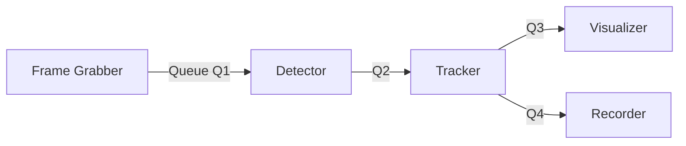

# Queue & Frame-Dropping Best Practices

> Designing a computer-vision **video pipeline** that can switch between real-time display and full offline recording requires different queue strategies, drop policies, and monitoring. This document collects community wisdom (OBS, GStreamer, vMix), cloud VOD operator notes (Mux), and practical lessons from ML pipelines.

---

## 1 Why Queue Size Matters

| Queue size | Latency impact                      | Memory impact | Typical use-case                                                                           |
| ---------- | ----------------------------------- | ------------- | ------------------------------------------------------------------------------------------ |
| **1**      | ≈ frame time but forces _lock-step_ | minimal       | Only when unpredictability is near-zero and producer ↔ consumer rates match exactly (rare) |
| **2 – 3**  | 33–100 ms @30 fps                   | small         | Real-time UI where latency < 100 ms is desired                                             |
| **≫ 3**    | grows linearly (N / FPS s)          | large         | Offline/batch mode; buffer until disk/encoder can catch up                                 |

A queue is _both_ a buffer and a throttle: too small and you drop/lock; too large and you accumulate latency or OOM.

---

## 2 Dual-Mode Strategy

### 2.1 Real-Time (Low-Latency) Mode

- **Goal:** show freshest frame; small, bounded latency.
- **Queue sizing:** 2–3 items (double-buffer plus spare).
- **Policy:** _Leaky (drop-old)_ at the **producer**. Implementation:
  ```python
  def put_realtime(q, msg):
      try:
          q.get_nowait()  # pop oldest
      except Empty:
          pass            # queue not full
      try:
          q.put_nowait(msg)
      except Full:
          pass            # extremely rare with pop above
  ```
  Dropping early avoids wasting compute on stale frames.
- **Where to drop:** immediately after acquisition—or at most after light preprocessing (resize, color-convert). Never drop post-inference if metadata/video need to stay aligned.

### 2.2 Offline / Archive Mode

- **Goal:** preserve _every_ frame; encoder/disk dictates throughput.
- **Queue sizing:** Unbounded (`maxsize=0`) **or** generously large (hundreds/thousands) based on RAM.
- **Policy:** _Blocking_ `put()` so producer slows down instead of discarding.
  ```python
  def put_offline(q, msg):
      q.put(msg)          # blocks when queue is full
  ```
- **Back-pressure:** Propagates naturally—frame grabber frame-rate adapts to slowest downstream stage.

---

## 3 Implementation Template

```python
# supervisor.py
offline = vis_config.get("save_to_file", False)
QSIZE   = 0 if offline else 3   # 0 == infinite in mp.Queue

grabber_out = mp.Queue(maxsize=QSIZE)
...
```

Inside each producer (frame grabber, detector, etc.):

```python
realtime = not save_to_file

def safe_put(q, msg):
    if realtime:
        put_realtime(q, msg)
    else:
        put_offline(q, msg)
```

---

## 4 Monitoring & Instrumentation

| Metric           | Real-time expectation | Offline expectation                |
| ---------------- | --------------------- | ---------------------------------- |
| `Queue.qsize()`  | 0–3                   | fluctuates; can be high            |
| `frames_dropped` | non-zero allowed      | **0** (alert if > 0)               |
| `stage_fps`      | ≥ camera FPS          | ≤ camera FPS (will slow as needed) |

Expose these via log lines / Prometheus for early detection.

---

## 5 Practical Tips

1. **Double-buffer minimum** – queues of size 1 hinder true parallelism; always aim for at least 2.
2. **Avoid mismatched drops** – if you split a stream (e.g., video + metadata) and later merge, ensure both branches apply identical drop policy or none at all.
3. **Disk I/O bottlenecks** – when recording to MP4/H.264, the `cv2.VideoWriter` or encoder is often the slowest component: blocking queues naturally absorb the slack.
4. **Latency-sensitive outputs** – if you also drive a projector/RTSP push, keep a separate real-time branch so offline blocking doesn't stall the live feed.
5. **Static config flag** – pass a single `realtime` / `offline` boolean through your dependency-injection to keep mode semantics consistent across all services.

---

## 6 Mermaid Overview



- Queues _Q1–Q3_ follow mode-specific sizing; _Q4_ is large/unbounded so the recorder never misses frames.

---

## 7 References

- OBS Studio – _Dropped Frames and Network Congestion_ (gist by `jp9000`)
- GStreamer docs – `queue` element, `leaky=upstream/downstream` semantics
- vMix Forum – _Dropped frames… finding the cause_ (thread)
- Mux Docs – _Minimize processing time_ (standard input, keyframe rules)

---

### Changelog

| Date       | Author       | Notes                                                           |
| ---------- | ------------ | --------------------------------------------------------------- |
| 2025-07-02 | AI assistant | Initial draft extracted from research & internal best practices |
