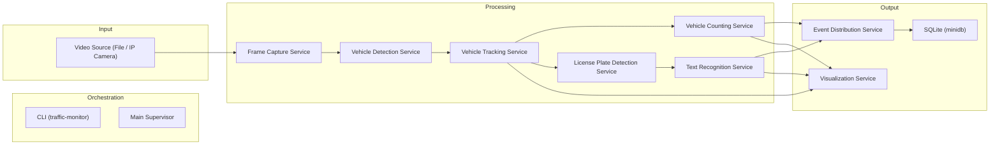
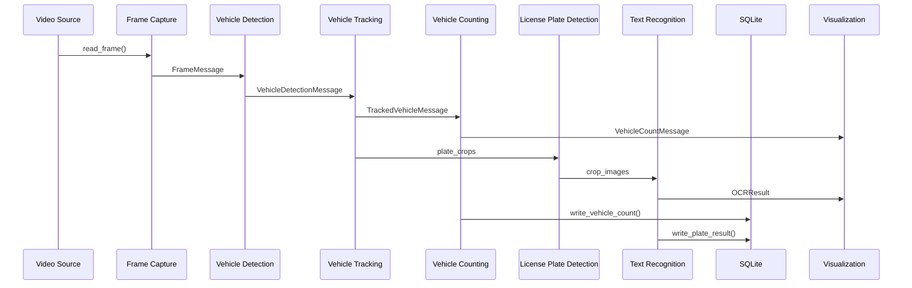

# Architecture

## High-Level System Architecture

The system is designed with a multiprocessing architecture, where each core functionality operates as an independent process, communicating via inter-process queues. Key components include:

- **`MainSupervisor`**: Orchestrates the entire system, launching and managing all worker processes.
- **`FrameCaptureService`**: Ingests video streams, decodes frames, and prepares them for further processing. Supports frame skipping and resizing.
- **`VehicleDetectionService`**: Detects vehicles within frames using a YOLO model, identifying bounding boxes, confidence scores, and class IDs.
- **`VehicleTrackingService`**: Tracks detected vehicles across frames using the BoxMOT library, assigning unique track IDs and maintaining object states.
- **`VehicleCountingService`**: Counts vehicles based on geometric intersections with predefined counting lines, preventing double-counting.
- **`LicensePlateDetectionService`**: (Implicit, based on OCR input) Likely responsible for detecting license plates within vehicle bounding boxes before passing them to the TextRecognitionService.
- **`TextRecognitionService`**: Performs Optical Character Recognition on license plate crops using configurable OCR engines (FastPlateOCR, PaddleOCR).
- **`VisualizationService`**: Renders real-time video feeds with overlays, including bounding boxes, track IDs, counting lines, and dynamic statistics.
- **`Persistence (minidb)`**: Manages data storage in an SQLite database for plate recognition results and vehicle count data, ensuring robust and concurrent write operations.
- **`Logging`**: A centralized logging system provides detailed insights into the application's runtime behavior, supporting multiprocessing environments and configurable output.

Inter-process communication is managed using `multiprocessing.Queue` to ensure efficient data flow and prevent bottlenecks.

## System Workflow

## Program Workflow (high-level)

1. Launch & CLI
   - The user starts the app via `python -m traffic_monitor.cli ...` (or just `traffic_monitor` if installed).
   - `src/traffic_monitor/cli.py` parses flags (e.g. `--config`, `--verbose`) and delegates to `main_supervisor.py`.

2. Supervisor initialization (`main_supervisor.py`)
   a. Sets the multiprocessing start-method to `spawn` for cross-platform safety.
   b. Loads `settings.yaml`, merges log-level, model paths, etc.
   c. Calls `setup_logging`; enables Loguru sinks / rotation.
   d. Initializes a lightweight SQLite / DuckDB via `utils.minidb`.
   e. Determines “offline” vs “real-time” mode (affects queue size & back-pressure strategy).
   f. Pre-creates all inter-process queues (bounded if real-time, unbounded if offline).
   g. Builds a list of child processes, each with its own config slice and queues.

3. Child processes (all located in `src/traffic_monitor/services`) – they run fully isolated:
   - FrameCaptureService   – Opens camera / video file via OpenCV, resizes & JPEG-encodes, pushes messages.
   - VehicleDetectionService – YOLOv8 detector (Ultralytics) → returns list of vehicle boxes.
   - VehicleTrackingService – BYTE-/DeepSORT style tracker → persistent IDs.
   - EventDistributionService – one-to-many fan-out; copies tracking messages to:
        – LicensePlateDetectionService (LP crops)
        – VehicleCountingService (virtual line crossing)
        – VisualizationService (for overlay)
        – SummaryService (metrics)
   - LicensePlateDetectionService – Detects plates inside vehicle boxes.
   - TextRecognitionService      – OCR (EasyOCR / Paddle) each plate; returns text.
   - VehicleCountingService      – Keeps per-class counters & temporal analytics.
   - VisualizationService        – Overlays all results, displays or writes video.
   - SummaryService (optional)   – Consumes copies of tracking / count / OCR queues, rolls up KPIs, persists to DB.

   All services share the queue-helper in `utils.queue_utils` which switches between:
   - offline mode → `put_offline` (blocking, preserve every frame)
   - real-time    → `put_realtime` (drop oldest when queue is full to keep latency low)

4. Runtime supervision loop
   - The supervisor thread polls every 0.5 s.
   - If any child exits with a non-zero code, it triggers graceful shutdown:
        – `shutdown_event` is set → all processes notice and finish.
   - If the user hits Ctrl-C, the same shutdown path runs.

5. Graceful shutdown
   - Supervisor joins each child (10 s timeout, then terminate).
   - Closes queues and Loguru sinks.
   - Database connection is closed; summary tables are flushed.

## Data Flow (message structure)

- Every message travelling through the pipeline is a simple `dict` that carries:
  `frame_id`, `timestamp`, `camera_id`, `frame_data_jpeg`, plus service-specific payloads
  (e.g. `detections`, `tracks`, `plate_text`, `counts`).

## Key Config Files

- `src/traffic_monitor/config/settings.yaml` – central place for paths, thresholds, ROI polygons.
- `pyproject.toml` – package metadata; declares `traffic_monitor.cli:main` console-script.

## Database

- `utils.minidb` offers a minimal ORM wrapper. Tables for events, summary stats, raw OCR results, etc.
- Automatically migrated on first run (`configure_database` + `init_db`).

## Logging

- All processes invoke `setup_logging()` so each child writes to the same rotating Loguru file (plus console when verbose).

That's the system workflow: a supervisor orchestrates a fan-out/fan-in video-analytics pipeline, using queues for back-pressure and multiple processes for parallelism, with optional offline (full retention) or real-time (low-latency) behavior.
