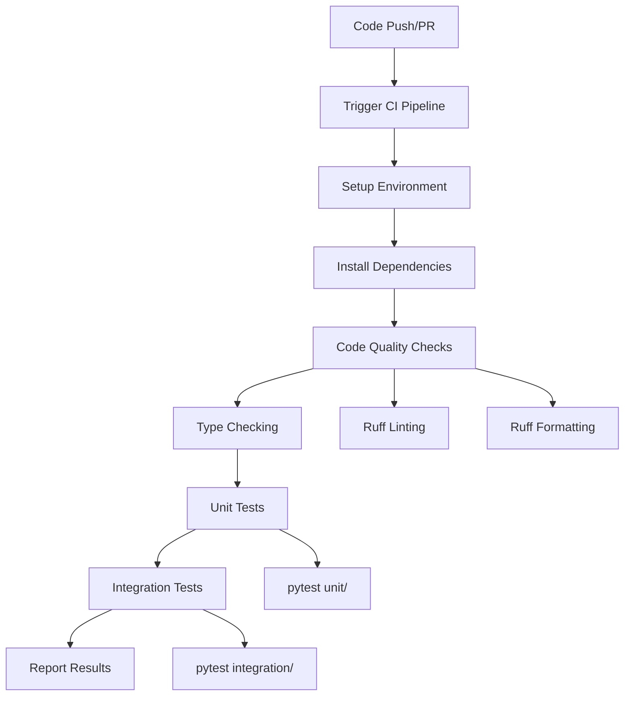

# CI/CD Guide for Traffic Monitor

This guide explains the Continuous Integration and Continuous Deployment (CI/CD) pipeline implemented for the Traffic Monitor project, how it works, and how to use it effectively.

## Table of Contents

1. [What is CI/CD?](#what-is-cicd)
2. [Our CI/CD Implementation](#our-cicd-implementation)
3. [Pipeline Structure](#pipeline-structure)
4. [How to Use the CI/CD Pipeline](#how-to-use-the-cicd-pipeline)
5. [Monitoring and Troubleshooting](#monitoring-and-troubleshooting)
6. [Best Practices](#best-practices)
7. [Advanced Configuration](#advanced-configuration)

## What is CI/CD?

**Continuous Integration (CI)** and **Continuous Deployment (CD)** are software development practices that help teams deliver code changes more frequently and reliably.

### Continuous Integration (CI)
- **Automated testing** of code changes
- **Code quality checks** (linting, formatting, type checking)
- **Build verification** to ensure code compiles/runs
- **Early detection** of integration issues

### Continuous Deployment (CD)
- **Automated deployment** to different environments
- **Release automation** with proper versioning
- **Rollback capabilities** for failed deployments
- **Environment consistency** across dev/staging/production

## Our CI/CD Implementation

The Traffic Monitor project uses **GitHub Actions** for CI/CD automation. The pipeline is defined in `.github/workflows/ci.yml` and provides:

- ✅ **Automated testing** on every push and pull request
- ✅ **Code quality enforcement** with linting and formatting
- ✅ **Type checking** with mypy
- ✅ **Multi-environment testing** (unit and integration tests)
- ✅ **Dependency management** with uv
- ✅ **Cross-platform compatibility** (Linux-based)

## Pipeline Structure

### Overview



### Workflow File Structure

```yaml
# .github/workflows/ci.yml
name: CI

on:
  push:
    branches: [ main, develop ]
  pull_request:
    branches: [ main ]

jobs:
  test:           # Main testing job
  integration-test: # Integration testing job
```

### Job Breakdown

#### 1. **Test Job** (Primary CI)
- **Triggers**: All pushes and pull requests
- **Environment**: Ubuntu Latest, Python 3.11
- **Steps**:
  1. Checkout code
  2. Setup Python environment
  3. Install uv package manager
  4. Install project dependencies
  5. Run linting checks (ruff)
  6. Run type checking (mypy)
  7. Run unit tests (pytest)
  8. Upload coverage reports

#### 2. **Integration Test Job**
- **Triggers**: Only on pushes (not PRs)
- **Dependencies**: Requires test job to pass
- **Purpose**: Run more comprehensive integration tests
- **Failure handling**: Continues on error (may need GPU/models)

## How to Use the CI/CD Pipeline

### For Developers

#### 1. **Local Development Workflow**

Before pushing code, run the same checks locally:

```bash
# Install dependencies
make dev-setup

# Run all quality checks (same as CI)
make lint          # Linting and formatting
make test          # Unit tests
make test-integration  # Integration tests (optional)

# Fix any issues before pushing
make format        # Auto-fix formatting issues
```

#### 2. **Push and Pull Request Workflow**

```bash
# 1. Create feature branch
git checkout -b feature/new-feature

# 2. Make changes and commit
git add .
git commit -m "feat: add new feature"

# 3. Push to GitHub (triggers CI)
git push origin feature/new-feature

# 4. Create Pull Request
# CI will automatically run and show results
```

#### 3. **Understanding CI Results**

When you push code or create a PR, you'll see:

- ✅ **Green checkmark**: All checks passed
- ❌ **Red X**: Some checks failed
- 🟡 **Yellow circle**: Checks are running

Click on the status to see detailed results.

### For Maintainers

#### 1. **Branch Protection Rules**

Configure branch protection in GitHub Settings:

```yaml
# Recommended settings for main branch
- Require status checks to pass before merging
- Require branches to be up to date before merging
- Required status checks:
  - test (ubuntu-latest, 3.11)
  - integration-test
- Require pull request reviews before merging
- Dismiss stale PR approvals when new commits are pushed
```

#### 2. **Merge Strategies**

- **Squash and merge**: For feature branches (clean history)
- **Merge commit**: For release branches (preserve branch history)
- **Rebase and merge**: For small fixes (linear history)

## Monitoring and Troubleshooting

### Common CI Failures and Solutions

#### 1. **Linting Failures**

```bash
# Error: Ruff found linting issues
# Solution: Fix locally and push
make lint          # See issues
make format        # Auto-fix formatting
# Fix remaining issues manually
```

#### 2. **Type Checking Failures**

```bash
# Error: mypy found type issues
# Solution: Add type hints or fix type errors
uv run mypy src/   # Run locally to see issues
```

#### 3. **Test Failures**

```bash
# Error: Tests failed
# Solution: Fix tests locally
make test          # Run tests locally
make test-unit     # Run specific test category
pytest tests/unit/test_specific.py -v  # Run specific test
```

#### 4. **Dependency Issues**

```bash
# Error: Package installation failed
# Solution: Update dependencies
uv sync            # Sync dependencies
uv add package     # Add new package
uv remove package  # Remove package
```

### Viewing Detailed Logs

1. Go to **GitHub Repository** → **Actions** tab
2. Click on the **failed workflow run**
3. Click on the **failed job**
4. Expand the **failed step** to see detailed logs

### CI Status Badges

Add status badges to your README:

```markdown
[](https://github.com/username/traffic-monitor/actions)
```

## Best Practices

### 1. **Code Quality Standards**

- **Always run checks locally** before pushing
- **Write tests** for new features
- **Keep commits small** and focused
- **Use descriptive commit messages**

```bash
# Good commit messages
feat: add vehicle counting service
fix: resolve config loading issue
docs: update installation guide
test: add unit tests for detection service
```

### 2. **Testing Strategy**

- **Unit tests**: Fast, isolated, no external dependencies
- **Integration tests**: Test component interactions
- **End-to-end tests**: Full system testing (manual/separate)

```bash
# Test organization
tests/
├── unit/           # Fast, isolated tests
├── integration/    # Component interaction tests
└── fixtures/       # Test data and utilities
```

### 3. **Dependency Management**

- **Pin dependency versions** in uv.lock
- **Regular updates** with testing
- **Security scanning** for vulnerabilities

```bash
# Update dependencies safely
uv sync --upgrade    # Update all dependencies
make test           # Ensure tests still pass
```

### 4. **Configuration Management**

- **Environment-specific configs** for different stages
- **Secrets management** for sensitive data
- **Configuration validation** in tests

## Advanced Configuration

### 1. **Custom GitHub Actions**

You can extend the pipeline with custom actions:

```yaml
# .github/workflows/ci.yml
- name: Custom Security Scan
  uses: ./.github/actions/security-scan
  with:
    scan-type: 'dependencies'
```

### 2. **Matrix Testing**

Test across multiple Python versions:

```yaml
strategy:
  matrix:
    python-version: [3.11, 3.12]
    os: [ubuntu-latest, windows-latest, macos-latest]
```

### 3. **Conditional Jobs**

Run jobs based on conditions:

```yaml
deploy:
  if: github.ref == 'refs/heads/main'
  needs: test
  runs-on: ubuntu-latest
```

### 4. **Secrets and Environment Variables**

Configure secrets in GitHub Settings → Secrets:

```yaml
env:
  API_KEY: ${{ secrets.API_KEY }}
  DATABASE_URL: ${{ secrets.DATABASE_URL }}
```

### 5. **Caching for Performance**

Speed up builds with caching:

```yaml
- name: Cache dependencies
  uses: actions/cache@v3
  with:
    path: ~/.cache/uv
    key: ${{ runner.os }}-uv-${{ hashFiles('uv.lock') }}
```

### 6. **Notifications**

Set up notifications for CI results:

```yaml
- name: Notify on failure
  if: failure()
  uses: 8398a7/action-slack@v3
  with:
    status: failure
    webhook_url: ${{ secrets.SLACK_WEBHOOK }}
```

## Workflow Examples

### 1. **Feature Development Workflow**

```bash
# 1. Start new feature
git checkout main
git pull origin main
git checkout -b feature/license-plate-detection

# 2. Develop with continuous testing
# Make changes...
make test          # Run tests locally
make lint          # Check code quality

# 3. Commit and push
git add .
git commit -m "feat: implement license plate detection"
git push origin feature/license-plate-detection

# 4. Create PR and wait for CI
# GitHub will automatically run CI pipeline
# Address any failures before requesting review
```

### 2. **Hotfix Workflow**

```bash
# 1. Create hotfix branch from main
git checkout main
git pull origin main
git checkout -b hotfix/critical-bug-fix

# 2. Make minimal fix
# Edit files...
make test          # Ensure fix works

# 3. Fast-track through CI
git add .
git commit -m "fix: resolve critical memory leak"
git push origin hotfix/critical-bug-fix

# 4. Create PR with "hotfix" label
# CI runs, then merge immediately after approval
```

### 3. **Release Workflow**

```bash
# 1. Create release branch
git checkout main
git pull origin main
git checkout -b release/v1.2.0

# 2. Update version and changelog
# Edit pyproject.toml, CHANGELOG.md
make test          # Full test suite

# 3. Create release PR
git add .
git commit -m "chore: prepare release v1.2.0"
git push origin release/v1.2.0

# 4. After CI passes and review, merge to main
# 5. Tag the release
git tag v1.2.0
git push origin v1.2.0
```

## Troubleshooting Guide

### Common Issues and Solutions

| Issue | Symptoms | Solution |
|-------|----------|----------|
| **Slow CI** | Long pipeline execution | Add caching, optimize dependencies |
| **Flaky tests** | Intermittent failures | Fix non-deterministic tests |
| **Merge conflicts** | PR can't be merged | Rebase branch on latest main |
| **Failed deployments** | Production issues | Implement rollback strategy |
| **Security alerts** | Dependency vulnerabilities | Update dependencies, security scan |

### Getting Help

1. **Check the logs** in GitHub Actions
2. **Run locally** to reproduce issues
3. **Ask for help** in team chat/issues
4. **Review documentation** for similar issues
5. **Check GitHub Status** for platform issues

## Conclusion

The CI/CD pipeline ensures code quality and reliability through automated testing and deployment. By following these practices:

- **Faster development** with early issue detection
- **Higher quality** through automated checks
- **Consistent deployments** across environments
- **Reduced manual errors** through automation
- **Better collaboration** with clear feedback

Remember: **CI/CD is a safety net, not a replacement for good development practices.** Always test locally, write good tests, and follow coding standards.

For questions or improvements to this CI/CD setup, please create an issue or discuss with the team.